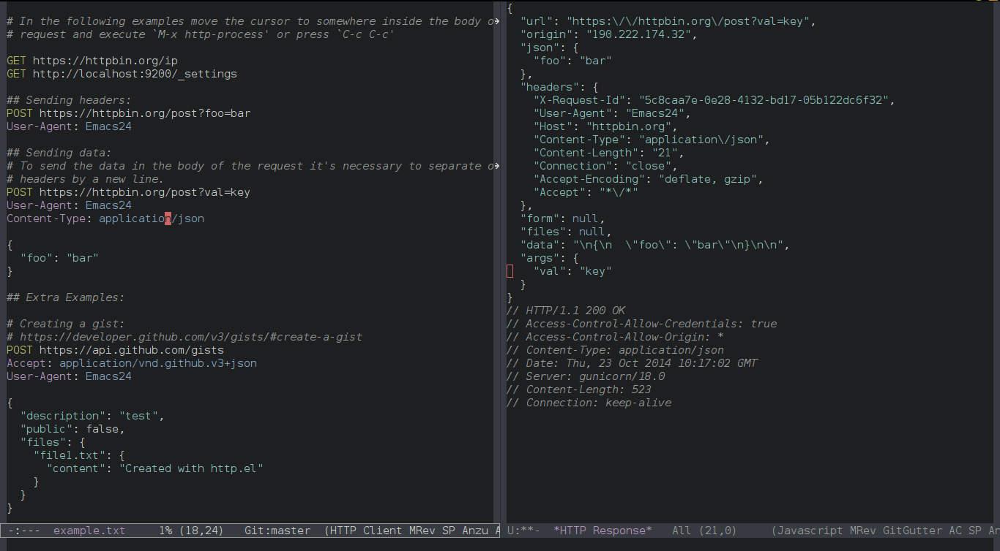

## http.el
*An HTTP client for Emacs -*- lexical-binding: t -*-*

---

`http.el` provides an easy way to interact with the HTTP protocol.

### Usage

Create a file with the following contents, and set `http-mode` as major mode.

    # -*- http -*-

    POST https://httpbin.org/post?val=key
    User-Agent: Emacs24
    Content-Type: application/json

    {
      "foo": "bar"
    }

Move the cursor somewhere within the description of the http request and
execute `M-x http-process` or press `C-c C-c`, if everything is went
well should show an buffer when the response of the http request:

More examples are included in file [misc/example.txt](misc/example.txt)

### TODO

+ [ ] Add code block support for org-mode

### Related projects

+ [httprepl.el](https://github.com/gregsexton/httprepl.el): An HTTP REPL for Emacs.
+ [restclient.el](https://github.com/pashky/restclient.el): HTTP REST client tool for Emacs.

### Function Documentation

#### `(http-query-alist QUERY)`

Return an alist of QUERY string.

#### `(http-parse-headers START END)`

Return the parsed http headers from START to END point.

#### `(http-capture-headers-and-body START END)`

Return a list of the form `(header body)` with the captured valued from START to END point.

#### `(http-end-parameters &optional START)`

Locate the end of request body from START point.

#### `(http-process)`

Process a http request.

-----

Markdown README file generated by
<a href="https://github.com/mgalgs/make-readme-markdown">make-readme-markdown.el</a>

