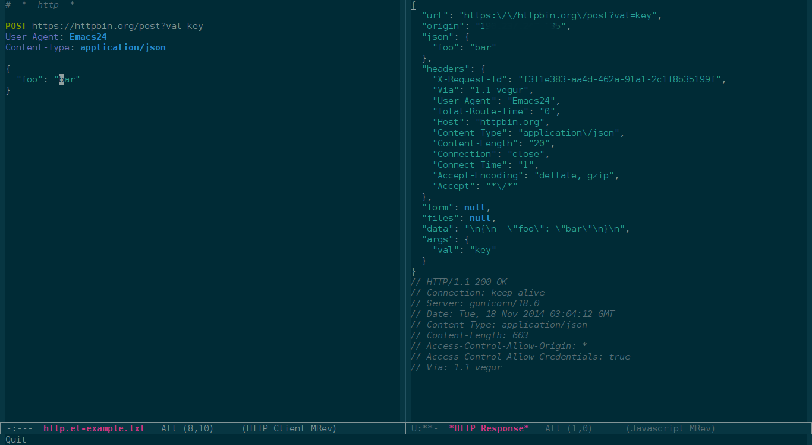

# http - Yet another HTTP client

*Author:* Mario Rodas <marsam@users.noreply.github.com> 
*Version:* 0.0.1 

`http.el` provides an easy way to interact with the HTTP protocol.

## Usage

Create a file with the following contents, and set `http-mode` as major mode.

    # -*- http -*-

    POST https://httpbin.org/post?val=key
    User-Agent: Emacs24
    Content-Type: application/json

    {
      "foo": "bar"
    }

Move the cursor somewhere within the description of the http request and
execute `M-x http-process` or press `C-c C-c`, if everything is went
well should show an buffer when the response of the http request:

More examples are included in file [misc/example.txt](misc/example.txt)

### Customisation

If you want to use a custom mode for rendering a response with
content-type equal to "application/json", say [json-mode][]:

        (add-to-list 'http-content-type-mode-alist
                     '("application/json" . json-mode))

If you want to use a custom prettify function for a response with
content equal to "application/json", say [json-reformat][]:

        (require 'json-reformat)
        (defun my/pretty-json-buffer ()
          (json-reformat-region (point-min) (point-max)))
        (add-to-list 'http-pretty-callback-alist
                     '("application/json" . my/pretty-json-buffer))

## Related projects

+ [httprepl.el][]: An HTTP REPL for Emacs.

+ [restclient.el][]: HTTP REST client tool for Emacs. You can use
  both projects indistinctly, the main differences between both
  are:

             | `restclient.el`   | `http.el`
  ---------- | ----------------- | -------------
  backend    | `url.el`          | `request.el`
  variables  | yes               | no

[httprepl.el]: https://github.com/gregsexton/httprepl.el "An HTTP REPL for Emacs"
[restclient.el]: https://github.com/pashky/restclient.el "HTTP REST client tool for Emacs"
[json-reformat]: https://github.com/gongo/json-reformat "Reformat tool for JSON"
[json-mode]: https://github.com/joshwnj/json-mode "Major mode for editing JSON files with emacs"

## TODO

+ [ ] Add code block support for org-mode

Related projects
+ [httprepl.el](https://github.com/gregsexton/httprepl.el): An HTTP REPL for Emacs.
+ [restclient.el](https://github.com/pashky/restclient.el): HTTP REST client tool for Emacs.

---
Converted from `http.el` by [*el2markdown*](https://github.com/Lindydancer/el2markdown).
